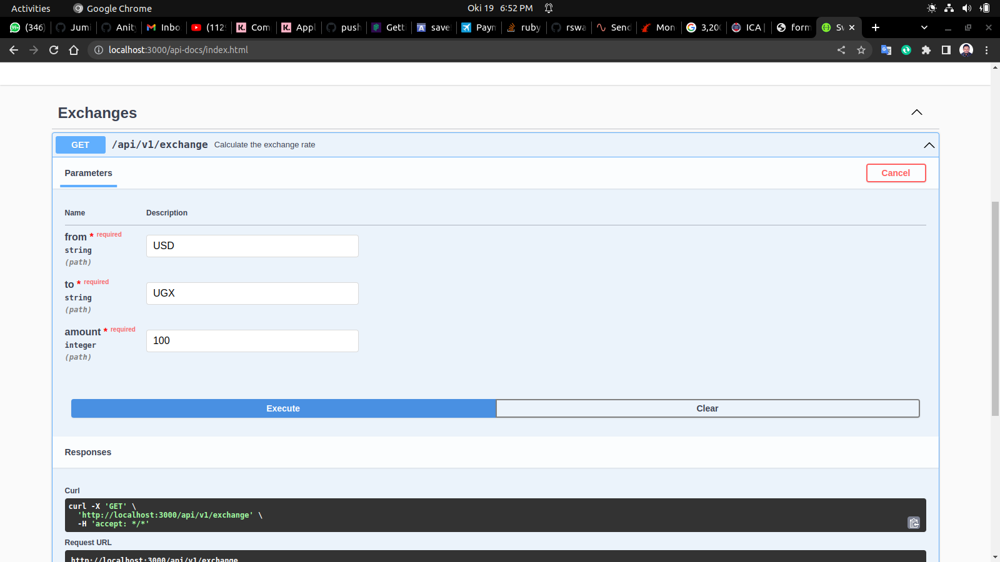

# MONEY EXCHANGE

On https://fixer.io/ you can sign up to get access to an WebApi that provides you with currency
exchange rates. The API provides the rates in JSON structures.
Sign up to get access and familiarize you with the API.
Below are a few programming tasks that utilize this service in different ways.
1. Create a ruby script within the rails project that takes in two currency codes and one
amount as input. The amount is in the first currency, and the script should calculate the
currency amount for the second currency code (using the latest exchange rates). The
program should do the calculation in process and not utilize any external calculation api.
2. Extend the program with an optional input date, do the same calculation as in step 1 but
use the currency rate for the date inputted to the program. You need to find out the url for
retrieving exchange rate a given date using the documentation on fixer.io.
3. Create a program that will be executed once a day. The program should retrieve the
latest exchange rate and store it in a database. This task involves designing a suitable
database structure.
Optional tasks (time permitting)
1. Create an API that offers the same calculations as in task 1-1 and task 1-2
2. Build a simple web on top of the service you created in task 2, that offers this calculation
service to the user.
3. Extend the API from task 2-1, with a new method to return all the exchange rates for one
currency for a given period of time. The exchange rates should be extracted from the
database created in task 1-3.
4. Build a web page on top of task 2-3, to show how an exchange rate develops for a time
period, find a satiable graphical component to visualize the exchange rate.
  models:

  - Exchange
  - Currency

### Deployment
 N/A `Kinldy i can't config my google SMTP because i using it to some of my projects that's why i did;\'nt deployed the app on heroku as well`
## Built With

- Rails
- Ruby 
- Postgresql
- Sidekiq
- Sidekiq cron 
- Redis
- Rswag

## Getting Started

Here are the steps to follow in order to get this project on your local computer.

### Prerequisites

`rails v7.0.2 +`

`ruby v3.0.2 +`

### Setup

clone this repo by typing `git clone https://github.com/vic778/money-exchange`

### Install

install the dependencies by typing `bundle install`

### Usage

start the local server by running `rails s`

### Testing

run the tests by typing `rails rswag`

### Documentation

## Author

👤 **Victor Barh**

- GitHub: [@Vvic778](https://github.com/vic778)
- Twitter: [@victoirBarh](https://twitter.com/)
- LinkedIn: [LinkedIn](https://linkedin.com/in/victoir-barh)

## 🤝 Contributing

Contributions, issues and feature requests are welcome!

Feel free to check the [issues page](https://github.com/vic778/money-exchange/issues/6)

## Show your support

Give a ⭐️ if you like this project!

## Acknowledgments

 N/A

## 📝 License

This project is [MIT](lic.url) licensed.